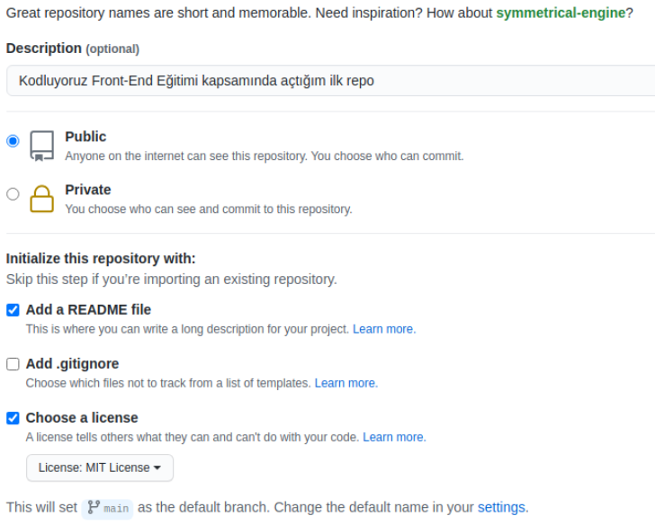

# Kodluyoruz İlk Repo
Bu repo Kodluyoruz Front-End Eğitiminde oluşturduğumuz ilk repo. İçerisinde bir adet README dosyası, bir adet de index.html barındırıyor.
## proje gorseli


## Installation
Öncelikle projeyi clonelayın. 
git clone https://github.com/tiksoz/kodluyoruzilkrepo.git

##Usage
Projeyi cloneladıktan sonra Visual Studio Code programında açınız.

Windows için:
```windows
cd kodluyoruzilkrepo
echo README.md
code . 
```

## Contributing
Pull requestler kabul edilir. Büyük değişiklikler için, lütfen önce neyi değiştirmek istediğinizi tartışmak için bir konu açınız.
## License
[MIT](https://choosealicense.com/licenses/mit/)